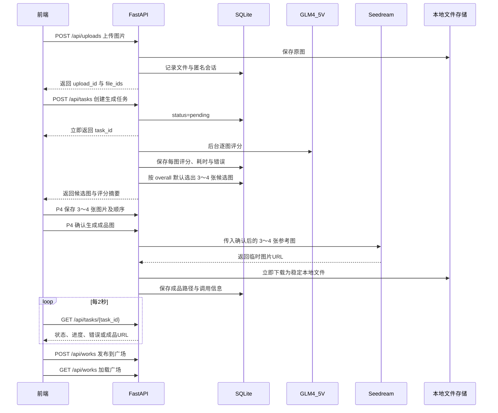

# 前后端 AI 联调与开发计划

## 目标架构

关键原则：前端绝不直接调用硅基流动或火山方舟，也不接触 API Key；图片 Base64、模型原始响应和内部错误不直接返回浏览器；Seedream 的 24 小时临时 URL 必须立即转存。

## 接口与信息传递

- 使用 [`backend/routers/uploads.py`](backend/routers/uploads.py) 的 `POST /api/uploads`：通过 `multipart/form-data` 接收 1–20 张图片，返回 `upload_id` 及 `file_id、filename、preview_url`。上传时校验格式、大小、SHA-256，并记录匿名 `session_id`。
- 在 [`backend/routers/tasks.py`](backend/routers/tasks.py) 实现“多图评分、候选图确认、成品图生成”流水线：
  - `POST /api/tasks` 请求体为 `upload_id、file_ids、work_name、template、style、material`，立即返回 `task_id`；不接收自由 prompt。
  - `GET /api/tasks/{task_id}` 返回统一状态、0–100 进度、已完成/总图片数、候选图片、最终 `result_url` 和适合用户阅读的错误信息。
  - `POST /api/tasks/{task_id}/selection` 保存 P4 确认的 3～4 张图片及顺序；`POST /api/tasks/{task_id}/compose` 触发最终成品图生成。
- 后端状态机统一为 `pending → scoring → selecting → awaiting_selection → generating → downloading → succeeded`，任一步骤可进入 `failed`；单张打分失败允许继续，成功评分少于 3 张时明确失败。
- 排名规则固定为 `overall` 降序，平分时依次比较 `face_clarity、identity、sharpness`，最后按上传顺序，保证结果可复现。模型固定为脚本中真实可处理图片的 `zai-org/GLM-4.5V`。
- 广场继续使用 [`backend/routers/works.py`](backend/routers/works.py)：只有 `succeeded` 任务可发布；前端用 `GET /api/works` 动态渲染，用点赞接口更新点赞数。
- 所有响应继续采用 `{code, message, data}`；HTTP 状态码表达请求成败，`message` 给用户看，内部诊断写数据库/日志。

## 信息记录设计

修改 [`backend/models.py`](backend/models.py)、[`backend/schemas.py`](backend/schemas.py) 与数据库初始化逻辑，记录以下内容：

- 匿名会话：浏览器首次访问生成 UUID，存 `localStorage`，后续通过 `X-Session-Id` 发送；数据库记录 `session_id`，不采集不必要的个人信息。
- 文件记录：原文件名、服务端路径、MIME、大小、宽高、上传时间、所属匿名会话；不把 Base64 存数据库。
- 任务记录：任务状态/进度、输入文件 ID、最终 4 张文件 ID、模板参数、实际 prompt 版本、请求模型、成品路径、创建/开始/结束时间、可公开错误与内部错误。
- 每图评分：`task_id、file_id、model、各维度分数、overall、recommend、reason、people_count、耗时、token 用量、状态、重试次数、错误码`；避免仅把全部结果塞进一个不可查询的 JSON。
- API 调用记录：供应商、模型、阶段、HTTP 状态、供应商 request_id、耗时、token/图片用量、重试次数、脱敏错误；绝不记录 API Key、Authorization 头和图片 Base64。
- 任务事件：记录每次状态切换及时间，便于定位“卡在评分还是生图”。
- 成品与作品：保存稳定本地 URL、模型实际返回名称、发布时间、匿名昵称、点赞数；原始供应商响应可脱敏后按任务归档，设置清理策略。

## 实施步骤

1. **先统一契约和配置**
   - 对齐 [`prototype/upload.html`](prototype/upload.html) 与后端枚举：故事地图统一为 `map`；物料只允许 `badge/postcard/keychain` 且字段为单数 `material`；作品名称统一为 `work_name`。
   - 在 [`backend/config.py`](backend/config.py) 增加模型名、超时、重试次数和产物目录配置；密钥仅从 `SILICONFLOW_API_KEY、ARK_API_KEY、ARK_IMAGE_MODEL` 环境变量读取，并提供不含密钥的 `.env.example`。
   - 调整 [`backend/main.py`](backend/main.py) 的开发 CORS，只允许实际前端 origin；前端必须由本地 HTTP 服务启动，不能直接用 `file://`。

2. **把两个一次性脚本改成可复用服务**
   - 从 [`algorithm/score_vl_models.py`](algorithm/score_vl_models.py) 提取 GLM-4.5V 单图打分函数，移除硬编码输入/输出目录与三模型循环，增加 429/5xx 指数退避、结构校验和可测试异常。
   - 从 [`algorithm/run_seedream_poster.py`](algorithm/run_seedream_poster.py) 提取四图生成函数，参数化图片路径、prompt、模型与输出路径；补全超时、下载失败、空结果和重试处理。
   - 在 `backend/ai/` 建立薄封装，复用算法函数而不是通过 `subprocess` 运行脚本；保留两个脚本作为本地调试入口。

3. **重构后台任务和数据表**
   - 改造 [`backend/routers/task.py`](backend/routers/task.py)：校验文件归属，逐图调用 GLM，边完成边提交评分与进度，稳定选出 4 张，再调用 Seedream 并下载产物。
   - 增加评分、调用日志和任务事件模型；为 `task_id、session_id、status、created_at` 建索引。
   - MVP 继续使用 FastAPI 后台任务，但在服务重启时把遗留 `scoring/generating/downloading` 任务标记为失败并允许用户重试；后续部署多实例时再迁移 Celery/RQ。

4. **接通前端真实流程**
   - 在 [`prototype/js/app.js`](prototype/js/app.js) 增加统一 `API_BASE`、请求封装、URL 拼接、错误展示、匿名会话和轮询逻辑。
   - [`prototype/upload.html`](prototype/upload.html) 改为真实上传：上传成功后创建任务，禁止重复提交，展示“上传/评分/筛选/生图/下载”阶段及进度。
   - 新增 P4 展示 3～4 张默认候选图及分数摘要，允许确认、替换和排序；结果页提供“发布到广场/重新生成”，刷新后凭 `task_id` 恢复进度。
   - [`prototype/index.html`](prototype/index.html) 从 `/api/works` 加载真实作品并接通点赞；[`prototype/mine.html`](prototype/mine.html) 按匿名 `session_id` 展示本机创建的任务与作品。

5. **按层联调与验收**
   - 第一阶段仅跑后端：用 5–8 张测试图片验证上传、评分排序、选择 3～4 张、生图转存及数据库记录。
   - 第二阶段接前端：在浏览器 Network 中确认请求体/响应、CORS、相对图片 URL、轮询停止条件和刷新恢复。
   - 补充单元测试：GLM 响应解析、平分排序、少于 3 张、部分评分失败、Seedream 空 URL；补充接口测试：非法文件、哈希不一致、越权 session、候选数量错误、重复发布、任务失败。
   - 最终验收：前端上传多图后立即得到 `task_id`，页面不因最长 180 秒模型调用而卡死；进度可见；失败可理解且可重试；成功图片重启后仍可访问并能发布到广场。

## 推荐开发顺序

先完成“后端真实流水线 + 数据记录 + API 测试”，再接“上传页与进度页”，最后改“广场与我的”。这样每一步都有独立可验证结果，也能避免前端等待尚未稳定的接口。
